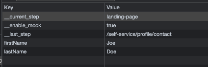
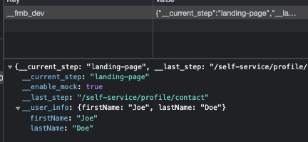

# storelify

Storelify is a front-end package that help you to storage all data into one localStorage object in order to keep things tidy.

Storelify stores properties in the `_envName` object in order to keep things tidy. When you set/get/remove a property you only have to specify the property name (and value if you are using the `setItem` function), and the service will automatically add it to the `_envName` localStorage object. It will create the object if it is not yet created.

Before:


After:


This project includes:

- [TypeScript](https://www.typescriptlang.org/)
- [Rollup](https://rollupjs.org/)
- [Microsoft API Extractor](https://api-extractor.com/)
- [TypeDoc](https://typedoc.org/)

## Usage

```sh
npm i -S storelify
```

Now, you should be able to use Storelify in your components.

Example:

```ts
import { Storelify } from "storelify";

// Don't forget to pass an env variable name where all properties will be saved, on initialization.
const storelify = new Storelify("__fmb_dev");

storelify.setItem("__enable_mock", true);
console.log("Is mock enabled?", storelify.getItem("__enable_mock")); // true
```

Avalaiable methods:

```ts
export declare class Storelify {
  setItem(key: string, value: any): void;
  getItem(key: string): any;
  removeItem(key: string): void;
  clearAll(): void;
}
```
